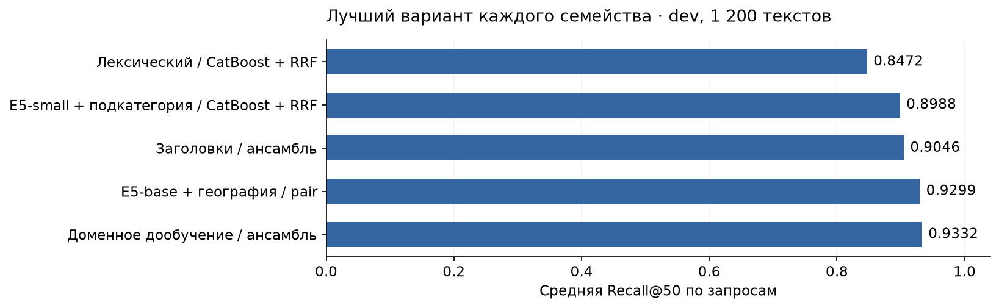

# Avito Ranker — поиск объявлений услуг

**Recall@50 на платформе: 0.882277.** Решение находит 50 объявлений для каждого из 2 452 запросов: объединяет лексический и семантический поиск, затем отбирает кандидатов ансамблем CatBoost. Оценка платформы сообщена автором отправки; скрытая разметка недоступна.

**Для проверяющего:** [выполненный Jupyter Notebook](solution.ipynb), [итоговый answer.csv](answer.csv), [данные и артефакты в релизе v1.0.0](https://github.com/pRaVsha1/avito_ranker/releases/tag/v1.0.0). Notebook содержит пояснения, сравнения, анализ ошибок и повторное вычисление ответа на CPU.

## Получить тот же answer.csv

Нужны Python 3.12, около 16 ГБ RAM и 20 ГБ свободного места для скачивания, сборки и распаковки комплекта. GPU и PyTorch для этого режима не требуются. Загрузка около 5.3 ГиБ выполняется один раз; после установки зависимостей и загрузки артефактов вычисления работают **без сети и внешних API**.

```bash
git clone https://github.com/pRaVsha1/avito_ranker.git
cd avito_ranker
python3.12 -m venv .venv
source .venv/bin/activate
python -m pip install -r requirements-inference.txt
python download_artifacts.py
python reproduce.py --data-dir data --artifacts-dir artifacts --output answer_reproduced.csv
```

В Windows окружение активируется командой `.venv\Scripts\activate`. Загрузчик проверяет SHA-256 частей, собранного архива и извлечённых файлов. Уже загруженные части используются повторно. Комплект доступен без авторизации в GitHub Release.

`reproduce.py` заново выполняет поиск и отбор, проверяет формат CSV и его контрольную сумму. Готовый `answer.csv` **не используется для получения предсказаний**. Сохранённые эмбеддинги — представления текстов, а не таблица ответов. Этот режим воспроизводит конкретный benchmark; для новых текстов нужно рассчитать эмбеддинги локальными моделями.

Ожидаемый SHA-256:

```text
2b8d52769712bb26ffd8b0f75ceceae1a7aec7eac474a0426a3058bafcc45def
```

Побитовое совпадение проверено на Linux и macOS, CPU. Локальный повтор на macOS занял около 5 минут. Новое обучение в другом окружении может дать численные отличия; проверенный способ получить отправленный CSV — предсказание из зафиксированных артефактов.

## Данные и признаки

Источник: [архив задания](https://disk.yandex.ru/d/sNhfo0YOjGtufg). Используются только предоставленные таблицы: 497 673 взаимодействия в `train.parquet`, 2 452 запроса и 189 212 объявлений benchmark. [Аудит данных](artifacts/data_audit.json) содержит схемы, пропуски, дубликаты, пересечения и контрольные суммы.

| Признаки | Для чего используются |
|---|---|
| Запрос, заголовок, параметры, начало описания | Лексическое совпадение и семантическая близость |
| Фильтры и категория | Уточнение намерения, покрытие параметров, прогноз подкатегории |
| Локация, координаты, флаг доставки | Совпадение локации, расстояние и географические статистики |
| Цена, рейтинг, число отзывов, контактные ограничения | Дополнительные признаки CatBoost; пропуски сохраняются |
| Исторические запросы и частоты взаимодействий | Отдельный поисковый индекс, популярность и статистические признаки |

Идентификаторы остаются строками с исходным регистром; `query_id` не используется как признак. Для лексики и разбиения нормализуются Unicode NFKC, регистр, `ё→е` и пробелы. Нейросети получают исходный текст с собственным токенизатором. В train обнаружено 30 619 полных дубликатов; рейтинг и отзывы часто отсутствуют. Идентификаторы benchmark уникальны.

## Алгоритм

1. **Лексический поиск.** BM25 по заголовку с повышенным весом, параметрам и началу описания; отдельные индексы заголовков и исторических запросов. Русский Snowball stemmer, `k1=1.2`, `b=0.75`. Символьный TF-IDF с n-граммами 3–5 помогает при опечатках и словоформах.
2. **Семантический поиск.** `multilingual-e5-small`, `multilingual-e5-base` и дообученная E5-small. Префиксы `query:`/`passage:`, masked mean pooling, L2-нормализация, до 256 токенов. Варианты запроса с фильтрами и без них, длинное и короткое представления объявления. Точный поиск скалярным произведением блоками.
3. **Объединение кандидатов.** До 200 глобальных и до 200 кандидатов той же локации из каждого источника, затем удаление повторов. Географический источник мягко уменьшает E5-base score на `0.025 × log(1 + расстояние в км)`. Обязательного отсечения по категории, локации или фильтрам нет.
4. **Обучаемый отбор.** CatBoost получает оценки и ранги источников, пересечения слов, покрытие фильтров и метаданные. MultinomialNB добавляет прогноз подкатегории; географические признаки — сглаженные частоты переходов между локациями. Сравниваются PairLogit, Logloss и смешивание с RRF.
5. **Итоговый ансамбль.** Ранговая смесь двух Logloss-моделей: 0.75 для модели с доменными признаками и 0.25 для модели с E5-base. Каждая смешана с поисковым RRF. Выбранные 50 уникальных ID сортируются лексикографически для канонической записи; порядок не влияет на Recall@50.

Доменная E5-small обучена 800 шагов, batch 48, симметричная multi-positive InfoNCE, temperature 0.02, AdamW `lr=1e-5`. Словарный слой фиксирован. Используется только разрешённая история обучающей части. Параметры — в [final_report.json](artifacts/final_report.json), [ensemble_domain.json](artifacts/ensemble_domain.json) и [подробном описании](docs/METHOD.md).

## Проверка качества

Разбиение 80/10/10 выполнено по **нормализованному тексту запроса**, `seed=42`: все варианты текста остаются в одной части. Для обучения отбора выбраны 8 000 текстов, для dev и test — по 1 200, один случайный контекст локации и фильтров на текст.

Локальный корпус — весь benchmark плюс недостающие позитивы экспериментальных запросов: 199 316 объявлений. Позитивы **не вставляются в найденные кандидаты dev/test**; ненайденные объявления остаются в знаменателе Recall@50. Отдельно измеряется полнота объединения кандидатов.

История, популярность, прогноз подкатегории, географические статистики и доменное дообучение используют train-часть с дополнительным исключением текстов обучения ранжировщика. Собственная положительная пара не становится признаком. При обучении CatBoost позитивы добавляются к примерам, известные позитивы исключаются из негативов. До 250 конкурентов на запрос: 80% сложных и 20% случайных из найденных. Перед benchmark статистики пересобраны на полном train.

Все параметры выбраны по dev. Test повторно оценивался после фиксации варианта и не использовался для настройки; это тот же контрольный набор, а не новая слепая выборка. Локальная метрика основана на наблюдавшихся выборах пользователей, **не на полной разметке релевантности**. Дополнение корпуса и неполные метки ограничивают сопоставимость с платформой.

| Вариант | Dev Recall@50 | Полнота кандидатов dev |
|---|---:|---:|
| Лексический поиск + RRF | 0.798194 | 0.918750 |
| Лексический поиск + CatBoost | 0.847222 | 0.918750 |
| E5-small + CatBoost | 0.893056 | 0.959583 |
| E5-small + прогноз подкатегории | 0.898750 | 0.959583 |
| E5-base + география, ансамбль | 0.929861 | 0.973750 |
| **Итоговый ансамбль с доменным дообучением** | **0.933194** | **0.973750** |

Итоговый test: **Recall@50 = 0.925903**, полнота кандидатов **0.980417**, 1 200 запросов. Подтверждённые оценки платформы: 0.756185 → 0.791763 → 0.833643 → 0.875740 → **0.882277**. [Журнал](submissions.json) связывает результат с SHA-256 файла. Это последовательные версии, а не локальная абляция.



## Ошибки и принятые решения

На dev пропущено **86 положительных пар**: 34 на этапе поиска и 52 при отборе 50. У 57 пропущенных пар различаются локации. [Примеры ошибок](artifacts/dev_errors.csv) относятся только к dev. Это пары, а не количество запросов.

- **Опечатки, словоформы, редкие слова:** символьный поиск и сохранение редких терминов (`min_df=1`).
- **Короткий запрос и длинное шумное описание:** отдельные представления заголовка и параметров, E5-base, доменное дообучение.
- **Удалённые услуги и противоречащие тексту фильтры:** мягкие признаки и сохранение глобальных кандидатов.
- **Позитив найден, но не входит в 50:** сложные конкуренты при обучении, географические признаки, сравнение ансамблей по dev.
- **Численная граница топ-200:** один экспериментальный ансамбль различался на одно объявление между Linux и macOS из-за FP32. Компонент `base_pair_d8` исключён целиком для всех запросов; итоговый CSV совпал на обеих системах. [Диагностика](artifacts/reproducibility_issue.json). Правил для отдельных `query_id` и восстановления benchmark-разметки нет.

Изменения проверялись как общие варианты. Остаточные ошибки показывают, что эти меры не устранили проблему полностью.

## Код и проверки

| Файл | Назначение |
|---|---|
| [solution.ipynb](solution.ipynb) | Выполненный разбор и повторное CPU-предсказание |
| [solution.py](solution.py) | `prepare`, индексы, базовый поиск, `train`, `predict`, `validate` |
| [advanced.py](advanced.py), [ensemble.py](ensemble.py) | Дополнительные источники, CatBoost, финальный ансамбль |
| [category_prior.py](category_prior.py), [geo_prior.py](geo_prior.py) | Статистики подкатегорий и географии |
| [encode_extra.py](encode_extra.py), [finetune_e5.py](finetune_e5.py) | Представления текстов и доменное дообучение |
| [reproduce.py](reproduce.py), [download_artifacts.py](download_artifacts.py) | Точное предсказание и подготовительная загрузка |
| [docs/TRAINING.md](docs/TRAINING.md) | Полный цикл подготовки и обучения |
| [docs/environment.json](docs/environment.json) | Фактические версии используемых пакетов на двух системах |

```bash
python solution.py validate --data-dir data --output answer_reproduced.csv
python -m unittest -v test_solution test_advanced
python -m jupyter nbconvert --execute --to notebook --inplace \
  --ExecutePreprocessor.timeout=1800 solution.ipynb
```

Все 10 кодовых ячеек notebook выполнены без ошибок; все 9 тестов пройдены. Тесты покрывают пустые тексты, неизвестную локацию, пропуски чисел, отсутствие совпадений, равные оценки, знаменатель Recall и квоты без повторов. [Отчёт воспроизводимости](artifacts/reproducibility.json) фиксирует проверки. График проверен отдельно; полный визуальный просмотр notebook остаётся ручным в Jupyter. Это ограничение визуальной проверки, не исполнения ячеек.

## Open-source компоненты

Использованы NumPy, pandas, PyArrow, SciPy, scikit-learn, NLTK/Snowball, [CatBoost](https://catboost.ai/docs/en/concepts/loss-functions-ranking), PyTorch, Hugging Face Transformers, Jupyter и Matplotlib. Версии расчётных библиотек зафиксированы в requirements-файлах.

Модели: [intfloat/multilingual-e5-small](https://huggingface.co/intfloat/multilingual-e5-small), ревизия `614241f622f53c4eeff9890bdc4f31cfecc418b3`; [intfloat/multilingual-e5-base](https://huggingface.co/intfloat/multilingual-e5-base), ревизия `d128750597153bb5987e10b1c3493a34e5a4502a`. Модели опубликованы под MIT; [описание Multilingual E5](https://arxiv.org/abs/2402.05672). Данные взяты из архива задания; отдельная лицензия на них этим репозиторием не предоставляется.

Источники и уведомления о лицензиях собраны в [THIRD_PARTY.md](docs/THIRD_PARTY.md). В Git хранится код, notebook, отчёты и итоговый CSV. Крупные файлы вынесены в релиз; [release_manifest.json](release_manifest.json) фиксирует их размеры и SHA-256. Кэши кандидатов, окружения, логи и промежуточные ответы в публикацию не входят.
